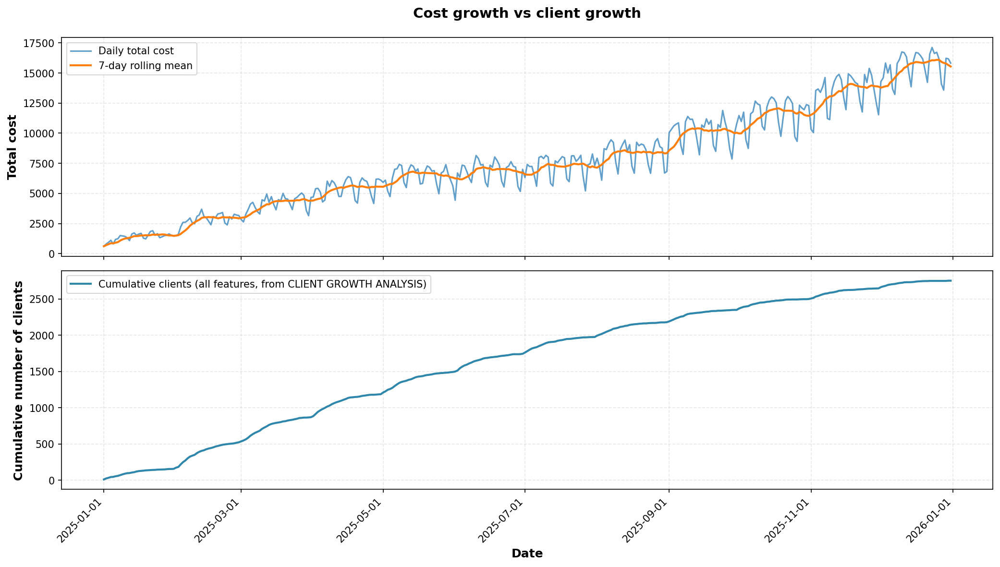
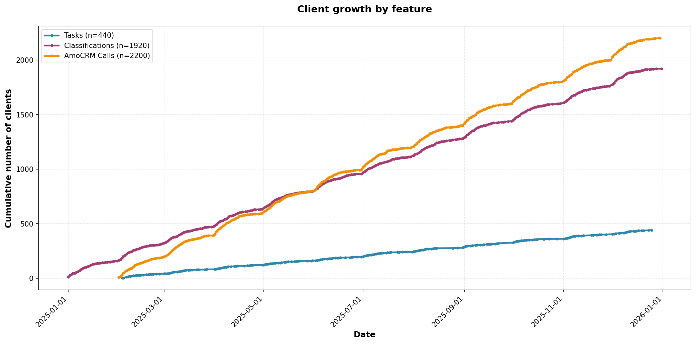
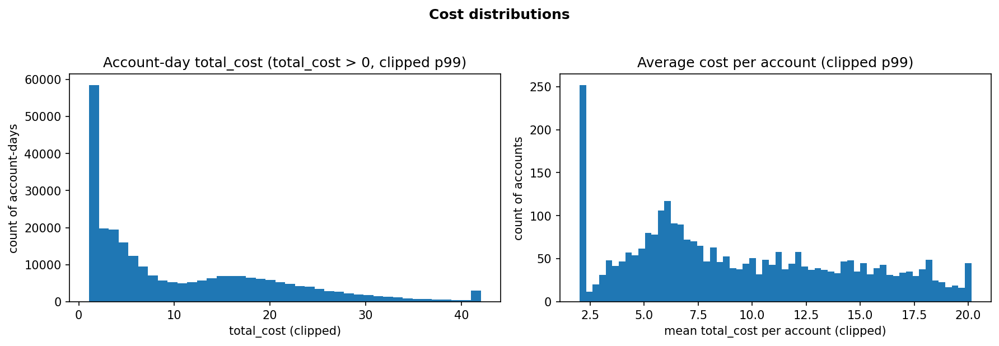

## EDA summary (synthetic dataset v0)

### Dataset overview

The synthetic dataset represents daily cost and usage at a chat-level granularity (`account_id × chat_id × date`) across the full 2025 calendar for **3,000 accounts**. Costs are decomposed into multiple components (dialog, tasks, classifications, AmoCRM calls), with derived service flags and usage counters. The injected dataset preserves the same account universe and date range, but modifies selected account-days according to scenario labels.

### Baseline temporal patterns and plausibility

Total daily cost shows a clear upward trend across the year with regular weekly seasonality (see below).

 

Client adoption curves by feature increase steadily over time, with different adoption rates across services.

This supports the plausibility of cost growth being driven by an expanding active user base rather than purely random noise.

### Distributions (cost and usage)

Cost is highly skewed with strong sparsity: for account-days with positive cost, the `total_cost` distribution is long-tailed

.

Usage-count distributions for tasks and AmoCRM calls are approximately unimodal with right tails, while classifications exhibit a heavier tail requiring a log-scaled view.

 

 These patterns are consistent with heterogeneous engagement across accounts and services.

### Seasonality checks

Mean per-account daily cost differs by weekday, with higher values on weekdays and lower values on weekends.

This indicates that the generator embeds day-of-week effects rather than producing exchangeable daily activity.

### Injected anomaly visibility (v0)

Anomalies are injected as sparse events affecting a subset of accounts over short windows.Zoomed comparisons confirm event-level deviations within each labeled window for cost spike, volume spike, and cap spike scenarios.

Because anomalies are sparse relative to the full population, they are most interpretable when inspected within the event window or using affected-account subsets.

### Edge cases and implications for detection/explanations

The dataset is intentionally sparse and “zero-inflated”, which is important for detector robustness:

* **Row-level sparsity:** ~90.1% of rows have all-zero costs (base and injected are similar).
* **Account-day sparsity:** ~76.1% of account-days have `total_cost = 0`.
* **Component sparsity:** the majority of account-days have zero component cost (e.g., tasks costs are zero on ~98.5% of account-days).
* **Concurrency baseline vs injection:** baseline chat density is low (`rows_per_account_day` p95 = 6; max = 31), while injected cap scenarios can create extreme maxima (up to 350), making cap violations structurally detectable.
* **Cost concentration:** top 1% of accounts contribute ~4.7–4.9% of total cost, implying anomalies may not dominate global aggregates.
* **Balanced channel mix:** chat types are near-uniform (~14% per major channel), reducing channel-skew artifacts in v0.

These edge cases motivate (i) analyzing distributions on the positive-cost subset, (ii) using robust baselines for anomaly detection, and (iii) ensuring explanation logic can handle zero-inflated component costs and short, sparse event windows.
